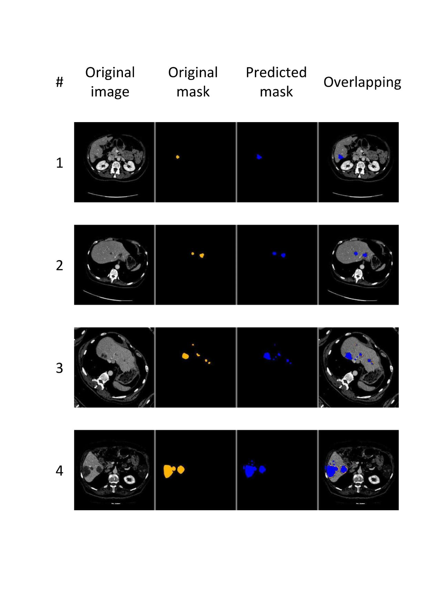
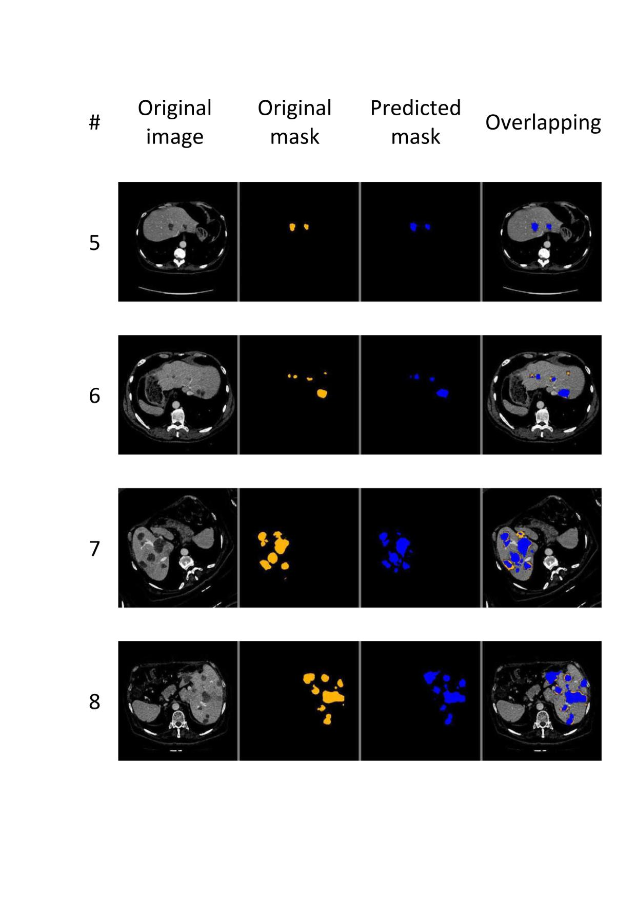
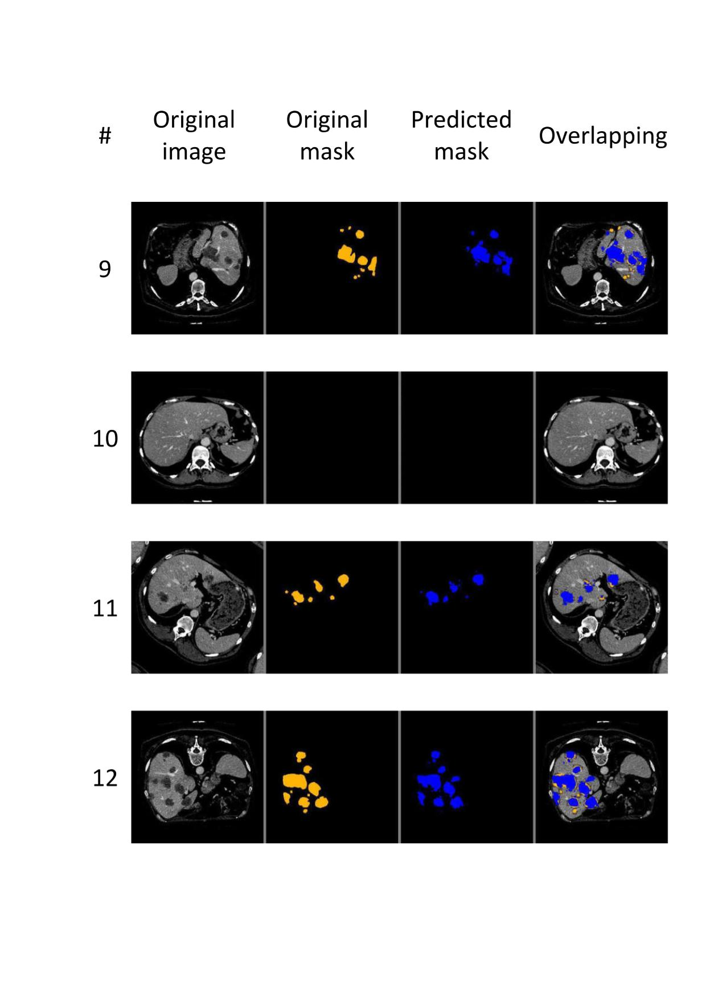

# Thesis Title
**"Automatic Primary Hepatic Tumors Segmentation in CT Images Using Convolutional Neural Networks"**

## Thesis Aim
The primary aim of this thesis was to develop a reliable algorithm for automatic segmentation of hepatic tumors using convolutional neural networks. The algorithm was designed to detect and segment the location, size, and spread of hepatic tumors, with the goal of saving time and effort for radiologists.

## Novelty in the Work
The unique contribution of this work is the creation of a liver tumor-specific machine-learning segmentation algorithm based on a modified U-Net derivative. The algorithm was developed through experimentation with different approaches, and it demonstrated decent and reliable performance.

## Author and Supervisors
- **Author:** Khalid Hani Abushahla
- **Supervisor:** Prof Dr. Terin Adali
- **Co-Supervisor:** Dr. Boran Şekeroğlu

## Final Metrics Results:
The project achieved a decent DICE score of:0.80670 

  
More Metrics

Accuracy: 0.99810
F1: 0.80331
Jaccard: 0.79097
Recall: 0.87509
Precision: 0.89232
IoU: 0.79079

## Affiliation
The work was conducted at NEU / Lefkoşa-Cyprus.

## Sample Images

